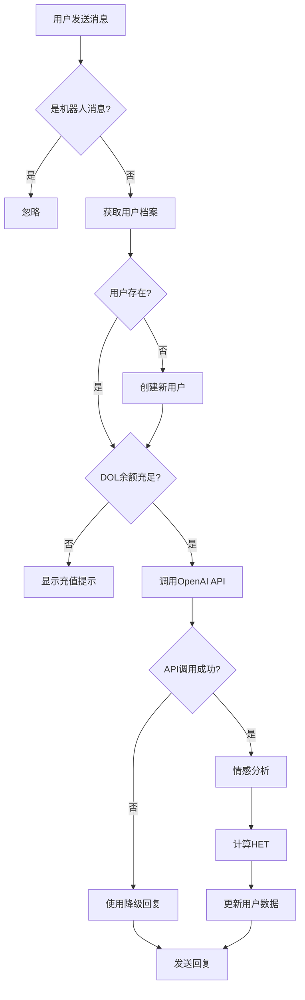
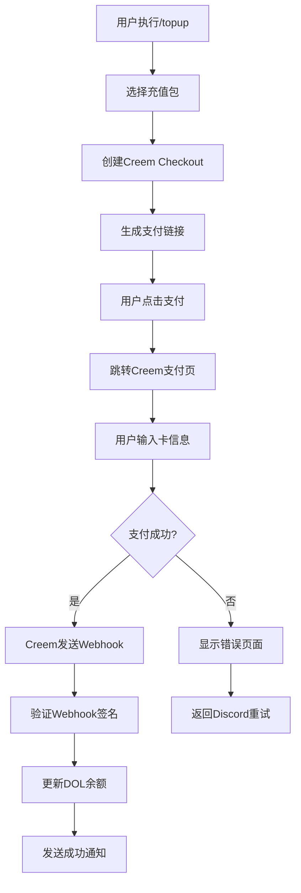

# 🤖 AI男友Discord机器人 - 项目架构文档

## 📋 项目概述

**项目名称**: AI男友Discord机器人  
**技术栈**: Node.js + Discord.js + OpenAI + Supabase + HuggingFace  
**部署平台**: Railway  
**版本**: MVP 1.0  

### 🎯 核心功能
- 💬 智能AI对话系统
- 💖 情感分析与亲密度成长
- 💎 DOL虚拟货币系统
- 📊 A/B测试与数据分析
- 💳 支付系统集成
- 🏆 社区互动功能

---

## 🏗️ 技术架构

### 🔧 技术栈详解

#### 后端技术
- **Node.js 18+**: JavaScript运行环境
- **Discord.js v14**: Discord API客户端库
- **OpenAI API**: GPT-4o-mini模型，负责AI对话生成
- **Supabase**: PostgreSQL数据库 + 实时订阅
- **HuggingFace Inference**: 情感分析模型API
- **Express.js**: Webhook服务器

#### 支付集成
- **Creem Payment**: 专为AI/SaaS设计的支付平台
- **支持信用卡**: Visa、MasterCard等主流信用卡
- **Webhook通知**: 实时支付状态更新

#### 部署与运维
- **Railway**: 容器化部署平台
- **GitHub**: 代码仓库与版本控制
- **Environment Variables**: 敏感配置管理

---

## 📁 项目文件结构

```
aiboyfriend/
├── 📂 src/                     # 核心源代码
│   ├── 📂 commands/           # Discord命令处理
│   │   └── slashCommands.js   # 斜杠命令定义和处理器
│   ├── 📂 config/             # 配置文件
│   │   ├── proxy.js           # 代理配置
│   │   └── discord-proxy.js   # Discord专用代理配置
│   ├── 📂 services/           # 业务逻辑服务
│   │   ├── ai.js              # OpenAI API集成
│   │   ├── database.js        # Supabase数据库操作
│   │   ├── emotion.js         # 情感分析服务
│   │   ├── payment.js         # 支付系统集成
│   │   └── webhook.js         # Webhook处理器
│   └── index.js               # 应用入口文件
├── 📂 scripts/                # 工具脚本
│   ├── debug-services.js      # 服务健康检查
│   ├── test-emotion-analysis.js # 情感分析测试
│   └── generate-invite-link.js # 邀请链接生成
├── 📂 marketing/              # 营销内容
│   ├── discord-server-intro.md    # 服务器详细介绍
│   ├── discord-welcome-message.md # 欢迎消息
│   └── discord-channel-intro.md   # 频道介绍
├── 📂 database/               # 数据库相关
│   └── schema.sql             # 数据库表结构
├── 📂 deploy/                 # 部署配置
├── 📄 配置文件
│   ├── package.json           # Node.js项目配置
│   ├── .env.example          # 环境变量示例
│   └── .gitignore            # Git忽略规则
└── 📄 文档文件
    ├── README.md              # 项目说明
    ├── QUICK_START.md         # 快速开始指南
    ├── problem-analysis-report.md # 问题分析报告
    └── PROJECT_ARCHITECTURE.md   # 本架构文档
```

---

## 🔍 核心模块详解

### 1. 📱 Discord机器人核心 (`src/index.js`)

**功能职责**:
- Discord客户端初始化和连接管理
- 事件监听和路由分发
- 消息处理主流程
- 错误处理和重连机制

**关键功能**:
```javascript
// 用户消息处理流程
Events.MessageCreate -> 
  获取用户档案 -> 
  检查DOL余额 -> 
  调用AI生成回复 -> 
  情感分析 -> 
  更新用户数据 -> 
  发送回复
```

**网络策略**: 使用简化的直连模式，提高连接稳定性

---

### 2. 🤖 AI服务模块 (`src/services/ai.js`)

**核心功能**:
- 基于用户亲密度的动态人设调整
- OpenAI GPT-4o-mini模型调用
- 聊天历史上下文管理
- 智能降级回复机制

**人设系统**:
```javascript
// 亲密度分级人设
低亲密度 (0-39): 友善但羞涩，逐渐了解用户
中亲密度 (40-79): 适度亲昵，分享个人想法  
高亲密度 (80+): 甜腻恋人模式，私密话题
```

**降级机制**: 当OpenAI API失败时，使用基于关键词的智能回复

---

### 3. 💗 情感分析系统 (`src/services/emotion.js`)

**技术实现**:
- **主要模型**: HuggingFace Transformers
- **中文支持**: `uer/roberta-base-finetuned-chinanews-chinese`
- **英文模型**: `j-hartmann/emotion-english-distilroberta-base`
- **降级方案**: 基于关键词的本地情感检测

**HET计算公式**:
```javascript
HET = tokenCount × emotionScore × intensityMultiplier
intensityMultiplier = 正面情感 ? 1.5 : 0.5
```

**阈值系统**:
- A组用户: 120 HET达标获得奖励
- B组用户: 100 HET达标获得奖励

---

### 4. 🗄️ 数据库服务 (`src/services/database.js`)

**数据表结构**:

#### `profiles` - 用户档案表
```sql
user_id: VARCHAR(20)      # Discord用户ID
intimacy: INTEGER         # 亲密度
dol: INTEGER             # DOL余额
ab_group: VARCHAR(1)     # A/B测试分组
created_at: TIMESTAMP    # 创建时间
updated_at: TIMESTAMP    # 更新时间
```

#### `sessions` - 聊天记录表
```sql
user_id: VARCHAR(20)     # Discord用户ID  
msg: TEXT               # 用户消息
bot_reply: TEXT         # 机器人回复
tokens: INTEGER         # Token使用量
het: INTEGER           # 高情感Token值
emotion_score: FLOAT   # 情感得分
created_at: TIMESTAMP  # 创建时间
```

#### `ab_events` - A/B测试事件表
```sql
user_id: VARCHAR(20)     # Discord用户ID
event_type: VARCHAR(50) # 事件类型
group_name: VARCHAR(1)  # 测试组别
metadata: JSONB        # 事件元数据
created_at: TIMESTAMP  # 创建时间
```

**数据库操作策略**:
- 主要查询: 使用数据库函数提高性能
- 降级查询: 直接SQL查询确保可用性
- 事务管理: 确保数据一致性

---

### 5. 💳 支付系统 (`creem-payment-integration.js`)

**Creem集成架构**:
```javascript
用户充值请求 -> 
  创建Checkout Session -> 
  生成支付链接 -> 
  用户完成支付 -> 
  Webhook通知 -> 
  验证签名 -> 
  更新DOL余额
```

**充值包配置**:
- 小额包: $5.00 = 500 DOL
- 标准包: $10.00 = 1200 DOL  
- 豪华包: $20.00 = 2500 DOL
- 至尊包: $50.00 = 7000 DOL

**安全机制**:
- Webhook签名验证
- 幂等性处理
- 支付状态同步

---

### 6. 🎮 命令系统 (`src/commands/slashCommands.js`)

**命令列表**:

#### `/stats` - 用户统计
- 显示亲密度、DOL余额、聊天统计
- 亲密度等级系统可视化
- 包含DOL使用指南

#### `/shop` - DOL商店  
- 展示所有充值选项
- 价格和优惠信息
- 直接跳转购买链接

#### `/topup [package]` - 充值DOL
- 创建Creem支付链接
- 安全的支付页面跳转
- 支付状态实时更新

#### `/leaderboard` - 排行榜
- 亲密度全服排名
- 匿名化用户显示
- 个人排名查询

#### `/help` - 帮助信息
- 完整功能介绍
- 使用说明和技巧
- 系统特性说明

---

## 🔄 业务流程图

### 💬 用户消息处理流程



### 💳 支付处理流程



---

## 🧪 测试与调试

### 调试工具

#### `scripts/debug-services.js`
**功能**: 全面的服务健康检查
- 环境变量验证
- Supabase连接测试
- OpenAI API测试
- HuggingFace API测试
- Discord API连通性检查

**使用方法**:
```bash
node scripts/debug-services.js
```

#### `scripts/test-emotion-analysis.js`
**功能**: 情感分析系统验证
- 16个测试用例覆盖各种情感场景
- HET计算准确性验证
- 阈值系统测试
- 性能指标统计

**使用方法**:
```bash
node scripts/test-emotion-analysis.js
```

### 错误处理策略

#### 服务降级机制
1. **OpenAI API失败**: 使用关键词匹配的智能回复
2. **数据库函数失败**: 降级到直接SQL查询
3. **情感分析失败**: 使用本地关键词检测
4. **支付API失败**: 显示备用支付说明

#### 日志系统
- 详细的错误分类和原因分析
- 彩色控制台输出提高可读性
- 关键业务节点的状态记录

---

## 🚀 部署架构

### Railway部署配置

**环境变量**:
```bash
# Discord配置
BOT_TOKEN=                # Discord机器人Token
CLIENT_ID=                # Discord应用ID

# OpenAI配置  
OPENAI_API_KEY=          # OpenAI API密钥

# Supabase配置
SUPABASE_URL=            # Supabase项目URL
SUPABASE_ANON_KEY=       # Supabase匿名密钥
SUPABASE_SERVICE_ROLE_KEY= # Supabase服务密钥(可选)

# HuggingFace配置
HUGGINGFACE_API_KEY=     # HuggingFace API密钥

# 支付配置(未来)
CREEM_API_KEY=           # Creem支付API密钥
WEBSITE_URL=             # 网站域名
```

**部署流程**:
1. GitHub代码推送触发自动部署
2. Railway拉取最新代码
3. 安装依赖包
4. 设置环境变量
5. 启动应用服务

---

## 📊 A/B测试系统

### 测试设计

**分组策略**:
- **A组**: 初始DOL 300，HET阈值 120
- **B组**: 初始DOL 400，HET阈值 100

**测试指标**:
- 用户留存率
- 充值转化率  
- 平均对话轮数
- 情感达标率

**数据收集**:
- 所有关键用户行为自动记录
- 实时A/B事件追踪
- 支持多维度数据分析

---

## 🔐 安全与隐私

### 数据安全
- 敏感信息环境变量存储
- Supabase RLS权限控制
- 用户ID匿名化显示

### API安全  
- 所有外部API调用异常处理
- 支付Webhook签名验证
- 防止重放攻击

### 隐私保护
- 聊天记录仅用于上下文，不做其他用途
- 用户排行榜匿名化显示
- 符合Discord开发者协议

---

## 📈 性能优化

### 数据库优化
- 合理的索引设计
- 数据库函数减少网络往返
- 降级查询确保可用性

### API调用优化
- OpenAI token使用控制
- HuggingFace请求频率限制
- 智能降级减少依赖

### 内存管理
- 聊天历史限制条数
- 定期清理无用数据
- 避免内存泄漏

---

## 🔮 未来扩展

### 功能扩展
- 多种AI男友人格选择
- 语音消息支持
- 图片生成功能
- 节日特殊活动

### 技术升级
- Redis缓存系统
- 消息队列处理
- 微服务架构
- 多语言支持

### 商业化增强
- 更多支付方式
- 订阅制服务
- 高级功能解锁
- 品牌合作推广

---

*文档更新时间: 2024年1月*  
*项目版本: MVP 1.0*  
*维护者: AI男友开发团队* 