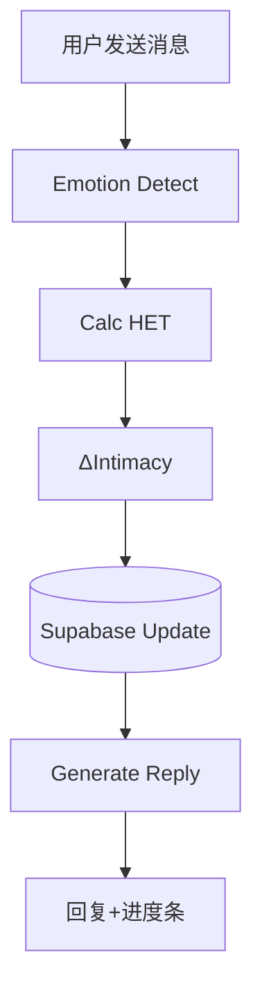

# AI Boyfriend – Intimacy Engine MVP Spec

> **目标**：在 Discord 机器人 MVP 阶段，用最小可行的「亲密度引擎 (Intimacy Engine)」创造 *沉浸式恋爱体验*，并验证用户付费意愿。

---

## 1 · 目标拆解

| 层级 | 目标                 | 可量化指标               |
| -- | ------------------ | ------------------- |
| 体验 | 让用户感觉「被理解、被惦记」     | >70 % 留存到第 2 天 (D1) |
| 业务 | 验证首单付费意愿           | 首单转化率 ≥ 8 %         |
| 技术 | 单轮响应 ≤ 5 s，99 % 可用 | 平均延时、错误率            |

---

## 2 · 产品需求 (PRD)

### 2.1 Feature List (MVP Only)

| #   | Feature    | 用户价值       | 技术范围                           |
| --- | ---------- | ---------- | ------------------------------ |
| F‑1 | **情感识别**   | AI 男友能「懂我」 | 5‑label 中文情感分类器 + 关键词兜底        |
| F‑2 | **亲密度增长**  | 用户看到关系变亲密  | HET → ΔIntimacy 公式 & 进度条 Embed |
| F‑3 | **昵称升级**   | 新称呼带来惊喜    | profile.nicknameTier + 模板渲染    |
| F‑4 | **主动私聊**   | 被动方也能收到关怀  | Scheduler + Discord Webhook    |
| F‑5 | **首单支付验证** | 试探付费意愿     | Creem 支付回调 & DOL 扣费            |

> **延后功能**：记忆、语音、图片、多模态、小游戏。

### 2.2 用户流程



---

## 3 · 功能实现详解

### 3.1 Emotion Detect

```ts
valence ∈ {-1,0,1}
intensity ∈ [0,1]
emotionScore = valence * intensity
```

* 模型：`uer/roberta-base-finetuned-jd-binary-chinese`
* 阈值：置信度 > 0.6 才定极性

### 3.2 HET 计算

```ts
tokens = text.length          // 汉字≈token
hetRaw = tokens * |emotionScore| * 1.2
HET    = clamp(round(hetRaw), 0, 100)
```

### 3.3 ΔIntimacy

```ts
function gain(HET){
  if(HET>=80) return 5;
  if(HET>=50) return 3;
  if(HET>=20) return 2;
  if(HET>=5)  return 1;
  return 0;
}
// 1h 冷却减半
gain = cooldown(userId, gain)
```

* 负情绪可加 +1 安慰分 (可配置)

### 3.4 进度条 Embed

```
█▓░░░ (34/60 💓)
```

* 仅当 ΔIntimacy > 0 显示

### 3.5 主动私聊 Scheduler

```cron
0 * * * *   // 每小时检查
```

```sql
SELECT id FROM profiles
WHERE intimacy>=40
  AND last_msg_at < NOW()-INTERVAL '24 HOURS';
```

### 3.6 支付闭环

1. DOL 余额 < 30 → 拦截弹窗
2. `/shop` 首单 ≥ ¥9.9：600 DOL + 限定语音
3. `payments` 表写入后异步加币

---

## 4 · 指标计算与监控

| 指标              | 公式                   | 工具                 |
| --------------- | -------------------- | ------------------ |
| **付费转化率**       | 首次充值人数 / 日活          | Supabase → Grafana |
| **Intimacy 均值** | avg(intimacy) by day | SQL Lens           |
| **响应延时**        | (t\_reply – t\_user) | CloudWatch         |
| **D1 留存**       | 次日发送消息用户数 / 日注册      | Supabase           |

---

## 5 · 任务规划 (4 人/天)

| Day | 任务                    | Owner |
| --- | --------------------- | ----- |
| 1   | 情感分类器封装 + HET 公式      | Dev A |
| 1‑2 | ΔIntimacy + DB schema | Dev B |
| 2   | Template 渲染 & 进度条     | Dev A |
| 2   | Creem 支付回调            | Dev C |
| 3   | 主动私聊 Scheduler        | Dev B |
| 3   | Discord Embed & UI QA | Dev A |
| 4   | 指标面板 & 负载测试           | Dev C |

---

## 6 · 上线 Checklist （Solo 版）

> **目标**：一个人也能快速、安全发布并随时回滚。共分两阶段：**T‑1（前夜准备）** 和 **T‑0（上线日）**。

### 6.1 T‑1 – 前夜准备

* **环境变量**：确保 `.env.production` 使用生产密钥，并已通过 Railway / Render 加密上传；本地 `.env` 保留测试配置。
* **数据库迁移与备份**：执行 `npm run migrate` 更新 Schema；随后运行 `supabase db dump > backup_prelaunch.sql` 生成备份文件。
* **模型额度检查**：在 OpenRouter 控制台确认剩余额度 ≥ 预估日用量的 3 倍。
* **支付预验**：将 Creem 切至生产环境，自付 ¥0.01，确认 `payments` 表写入且 DOL 增加。
* **本地冒烟测试**：`npm run build && npm run test` 全绿；`docker compose up` 启动后 AI 回复正常。

### 6.2 T‑0 – 发布与自测

* **部署**：在 Railway / Render 点击 *Deploy*；若日志连续 5 分钟无报错即视为成功。
* **功能自测**：

  1. 连续发送 3 条消息，确认响应 < 5 秒，亲密度进度条正常。
  2. 手动耗尽 DOL 余额，验证充值提示。
  3. 充值 ¥9.9，确认 Creem 回调成功并礼包到账。
* **数据快照**：执行 `supabase db dump > backup_launch.sql` 记录上线后初始数据。
* **公告**：在 Discord `#announcements` 频道发布上线通知。

### 6.3 回滚方案 回滚方案 T‑0 – 发布与自测

*

### 6.3 回滚方案

* **服务异常**：Railway → *Rollback* 选择上一镜像。
* **数据异常**：`psql -f backup_prelaunch.sql` 恢复。

### 6.4 上线后重点监控

| 指标                  | 触发警报阈值       | 快速检查方式                    |              |
| ------------------- | ------------ | ------------------------- | ------------ |
| **Latency p95**     | > 5 s        | Grafana 面板 `latency_p95`  |              |
| **Error Rate**      | > 2 %        | \`tail -f logs            | grep ERROR\` |
| **Payment Failure** | > 1 / 10 min | Grafana `payments_failed` |              |
| **首单付费率**           | < 8 %（日）     | Supabase SQL 手动查询         |              |
| **D1 留存率**          | < 70 %（日）    | Supabase SQL 手动查询         |              |

> 每天花 10 min 查看 Grafana 与 Supabase；异常即查看日志或回滚。

## 7 · 后续迭代路线 · 后续迭代路线

1. **记忆功能** (上下文持久化)
2. **语音 + 图片** (高阶资产)
3. **好友排行** (社交竞争)
4. **Prompt 自动演化** (A/B + RLHF)

> 🗝️ **原则**：任何新功能必须直接提升 *Intimacy Engine* 或 *付费转化*.
>  · 后续迭代路线

